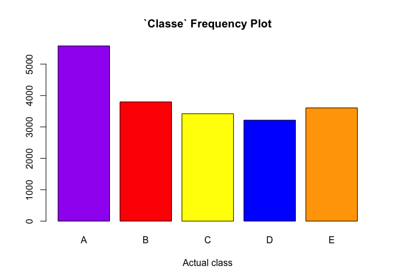
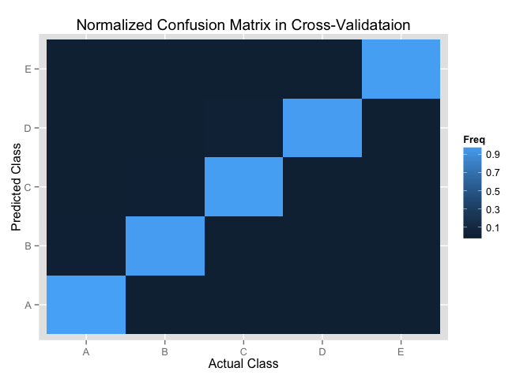

# Human Activity Recognition Project

###Introduction

The 'quantified self' movement describes a group of enthusiasts who are interested in measuring and recording all aspects of their daily lives using wearable devices such as Jawbone Up, Nike FuelBand, and Fitbit. As a result of this, massive data are generated every day.  One thing these people regularly do is quantifing how much of a particular activity they do, but not on 'how well' they do it.  

###Study design and objectives

Human activity recognition study recuited 6 male participants aged between 20-28 years with little weight lifting experience. They were asked to perform barbell lifting (1.25kg) in 5 different ways,

* Class A: ex:ctly according to the specification (the correct way)
* Class B: throwing the elbows to the front (common error)
* Class C: lifting the dumbbell only halfway (common error)
* Class D: lowering the dumbbell only halfway (common error)
* Class E: throwing the hips to the front (common error)

Data were collected from accelerometers on the belt, forearm, arm, and dumbell of 6 participants when they performed weight lifting correctly and incorrectly. 

The objectives of this project are: 

* Predict the manner in which the study subjects did the exercise indicated by classe variable.
* Build a prediction model using features from data set and cross-validation method.
* Estimate the out-of-sample error.
* Use the prediction model to predict 20 seperate test cases.

###Data analysis and results

####Download data
Data sets are downloaded from the course website, "pml-training.csv" data are used for prediction model development; "pml-testing.csv" data contain 20 questions for model testing. 


```r
library(caret)
```

```
## Loading required package: lattice
## Loading required package: ggplot2
```

```r
library(randomForest)
```

```
## randomForest 4.6-10
## Type rfNews() to see new features/changes/bug fixes.
```

```r
library(Hmisc)
```

```
## Loading required package: grid
## Loading required package: survival
## Loading required package: splines
## 
## Attaching package: 'survival'
## 
## The following object is masked from 'package:caret':
## 
##     cluster
## 
## Loading required package: Formula
## 
## Attaching package: 'Hmisc'
## 
## The following object is masked from 'package:randomForest':
## 
##     combine
## 
## The following objects are masked from 'package:base':
## 
##     format.pval, round.POSIXt, trunc.POSIXt, units
```

```r
library(foreach)
library(doParallel)
```

```
## Loading required package: iterators
## Loading required package: parallel
```

```r
library(parallel)
```


```r
url1<-"https://d396qusza40orc.cloudfront.net/predmachlearn/pml-training.csv"
url2<-"https://d396qusza40orc.cloudfront.net/predmachlearn/pml-testing.csv"
train.data<- download.file(url1, destfile="/Users/zhihuang/desktop/PML_Project1/pml-training.csv", method="curl")
test.data<- download.file(url2, destfile="/Users/zhihuang/desktop/PML_Project1/pml-testing.csv", method="curl")
```

####Data cleaning

Read in data and convert 'blank' or '#DIV/0!' to NA for the subsequent removal.


```r
train<-read.csv("/Users/zhihuang/desktop/PML_Project1/pml-training.csv", na.strings=c("NA","#DIV/0!", ""))
test<-read.csv("/Users/zhihuang/desktop/PML_Project1/pml-testing.csv", na.strings=c("NA","#DIV/0!", ""))
dim(train); dim(test)
```

```
## [1] 19622   160
```

```
## [1]  20 160
```

Remove columns with NA, and also the first 7 columns since they are inrelavent to this analysis.


```r
train.tidy <-train[, colSums(is.na(train)) == 0][-(1:7)]
test.tidy <-test[, colSums(is.na(test)) == 0][-(1:7)]
dim(train.tidy); dim(test.tidy)
```

```
## [1] 19622    53
```

```
## [1] 20 53
```

```r
names(train.tidy)
```

```
##  [1] "roll_belt"            "pitch_belt"           "yaw_belt"            
##  [4] "total_accel_belt"     "gyros_belt_x"         "gyros_belt_y"        
##  [7] "gyros_belt_z"         "accel_belt_x"         "accel_belt_y"        
## [10] "accel_belt_z"         "magnet_belt_x"        "magnet_belt_y"       
## [13] "magnet_belt_z"        "roll_arm"             "pitch_arm"           
## [16] "yaw_arm"              "total_accel_arm"      "gyros_arm_x"         
## [19] "gyros_arm_y"          "gyros_arm_z"          "accel_arm_x"         
## [22] "accel_arm_y"          "accel_arm_z"          "magnet_arm_x"        
## [25] "magnet_arm_y"         "magnet_arm_z"         "roll_dumbbell"       
## [28] "pitch_dumbbell"       "yaw_dumbbell"         "total_accel_dumbbell"
## [31] "gyros_dumbbell_x"     "gyros_dumbbell_y"     "gyros_dumbbell_z"    
## [34] "accel_dumbbell_x"     "accel_dumbbell_y"     "accel_dumbbell_z"    
## [37] "magnet_dumbbell_x"    "magnet_dumbbell_y"    "magnet_dumbbell_z"   
## [40] "roll_forearm"         "pitch_forearm"        "yaw_forearm"         
## [43] "total_accel_forearm"  "gyros_forearm_x"      "gyros_forearm_y"     
## [46] "gyros_forearm_z"      "accel_forearm_x"      "accel_forearm_y"     
## [49] "accel_forearm_z"      "magnet_forearm_x"     "magnet_forearm_y"    
## [52] "magnet_forearm_z"     "classe"
```

```r
##plot the actual class
plot(train.tidy$classe,col= c("purple","red", "yellow", "blue", "orange"), main = "`Classe` Frequency Plot", xlab="Actual class")
```

 

####Model building

The class prediction model for this project was fitted using "random forest" method since this method produces the highest accuracy of sample prediction.

 * First we partition the training data into training set and cross-validation set at 6:4 ratio.  We applied 60% of training data to train the model and 40% of the data for testing and estimation of the out-of-sample error.


```r
set.seed(1000)
inTrain <- createDataPartition(train.tidy$classe, p = 0.6, list = FALSE)
training <- train.tidy[inTrain, ]
testing <- train.tidy[-inTrain, ]
```

* Train the prediction model using the features in the training data set


```r
registerDoParallel()
classe <- training$classe
variables <- training[-ncol(training)]

model <- foreach(ntree=rep(125, 4), .combine=randomForest::combine, .packages='randomForest') %dopar% {
randomForest(variables, classe, ntree=ntree) 
}
```

 * Test the prediction model in cross-validation data set


```r
training_pred <- predict(model, training)
confusionMatrix(training_pred, training$classe)
```

```
## Confusion Matrix and Statistics
## 
##           Reference
## Prediction    A    B    C    D    E
##          A 3348    0    0    0    0
##          B    0 2279    0    0    0
##          C    0    0 2054    0    0
##          D    0    0    0 1930    0
##          E    0    0    0    0 2165
## 
## Overall Statistics
##                                      
##                Accuracy : 1          
##                  95% CI : (0.9997, 1)
##     No Information Rate : 0.2843     
##     P-Value [Acc > NIR] : < 2.2e-16  
##                                      
##                   Kappa : 1          
##  Mcnemar's Test P-Value : NA         
## 
## Statistics by Class:
## 
##                      Class: A Class: B Class: C Class: D Class: E
## Sensitivity            1.0000   1.0000   1.0000   1.0000   1.0000
## Specificity            1.0000   1.0000   1.0000   1.0000   1.0000
## Pos Pred Value         1.0000   1.0000   1.0000   1.0000   1.0000
## Neg Pred Value         1.0000   1.0000   1.0000   1.0000   1.0000
## Prevalence             0.2843   0.1935   0.1744   0.1639   0.1838
## Detection Rate         0.2843   0.1935   0.1744   0.1639   0.1838
## Detection Prevalence   0.2843   0.1935   0.1744   0.1639   0.1838
## Balanced Accuracy      1.0000   1.0000   1.0000   1.0000   1.0000
```

```r
testing_pred <- predict(model, testing)
confusionMatrix(testing_pred, testing$classe)
```

```
## Confusion Matrix and Statistics
## 
##           Reference
## Prediction    A    B    C    D    E
##          A 2228   19    0    0    0
##          B    4 1494    9    0    0
##          C    0    5 1357   21    1
##          D    0    0    2 1265    3
##          E    0    0    0    0 1438
## 
## Overall Statistics
##                                           
##                Accuracy : 0.9918          
##                  95% CI : (0.9896, 0.9937)
##     No Information Rate : 0.2845          
##     P-Value [Acc > NIR] : < 2.2e-16       
##                                           
##                   Kappa : 0.9897          
##  Mcnemar's Test P-Value : NA              
## 
## Statistics by Class:
## 
##                      Class: A Class: B Class: C Class: D Class: E
## Sensitivity            0.9982   0.9842   0.9920   0.9837   0.9972
## Specificity            0.9966   0.9979   0.9958   0.9992   1.0000
## Pos Pred Value         0.9915   0.9914   0.9805   0.9961   1.0000
## Neg Pred Value         0.9993   0.9962   0.9983   0.9968   0.9994
## Prevalence             0.2845   0.1935   0.1744   0.1639   0.1838
## Detection Rate         0.2840   0.1904   0.1730   0.1612   0.1833
## Detection Prevalence   0.2864   0.1921   0.1764   0.1619   0.1833
## Balanced Accuracy      0.9974   0.9911   0.9939   0.9915   0.9986
```


```r
#Normalized confusion matrix in corss validation data set
A <- matrix(c(0.998,0.012,0.000,0.000,0.000,0.002,0.985,0.007,0.000,0.000,0.000,0.003,0.993,0.016,.001,0.000,0.000,0.001,0.984,0.002,0.000,0.000,0.000,0.000,0.997), nrow=5, ncol=5, byrow = TRUE)       
dimnames(A) = list(c("A", "B", "C", "D", "E"),c("A", "B", "C", "D", "E"))   
confusion <- as.data.frame(as.table(A))
plot <- ggplot(confusion)
plot + geom_tile(aes(x=Var1, y=Var2, fill=Freq)) + scale_x_discrete(name="Actual Class") + scale_y_discrete(name="Predicted Class") + scale_fill_gradient(breaks=seq(from=-.5, to=4, by=.2)) + labs(fill="Freq",title = "Normalized Confusion Matrix in Cross-Validataion")
```

 


The results show that the 'in-sample' accuracy of the model is 100% obtained from the training data; 'the-out-of sample' accuracy is around 99.2% from the cross-validation testing data, the 'out-of-sample error' is <1%. 

####Use the prediction model to predict 20 different testing cases


```r
answers <- predict(model, test.tidy)
answers <- as.character(answers)
answers

##export answers as txt files
pml_write_files = function(x) {
    n = length(x)
    for (i in 1:n) {
        filename = paste0("problem_id_", i, ".txt")
        write.table(x[i], file = filename, quote = FALSE, row.names = FALSE, 
            col.names = FALSE)
    }
}

pml_write_files(answers)
```

The prediction on 20 test cases are 100% accurate using this model.

####Conclusion

The class prediction model that we built from the trainging data using 'random forest' method yields a highly accurate algorithms (>99%) for test case prediction.  


####References:

(1) Data source: http://groupware.les.inf.puc-rio.br/har.

(2) Velloso, E.; Bulling, A.; Gellersen, H.; Ugulino, W.; Fuks, H. Qualitative Activity Recognition of Weight Lifting Exercises. Proceedings of 4th International Conference in Cooperation with SIGCHI (Augmented Human '13) . Stuttgart, Germany: ACM SIGCHI, 2013.

